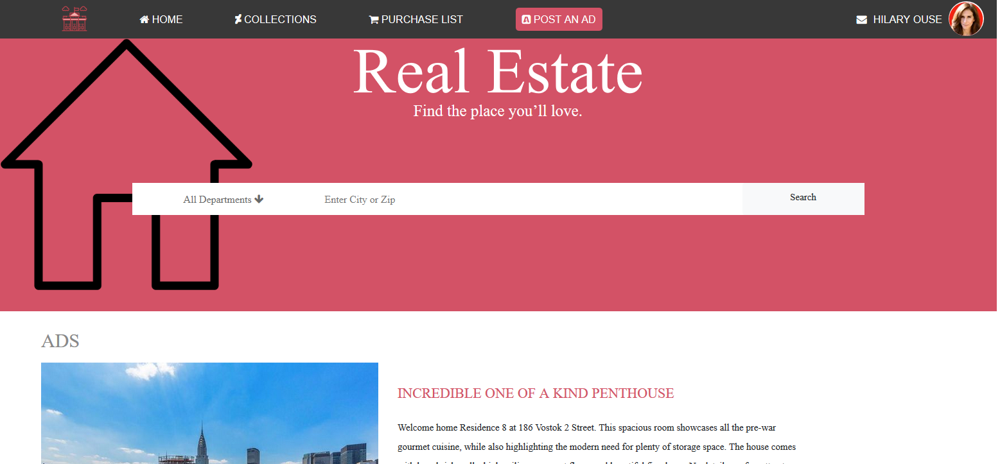

Responsive E-commerce style website (Capstone).

- It's a real-world-like project, built with business specifications.

Additional description about the project and its features.

- The Home page is the main page (search page), with a link to the results page by clicking the search button
- the search results page, where the results that the user input will be displayed.

- There's a mobile version up to 768px
- There's a tablet & desktop version from 1024px+

Project anchor tags (links) are only simulations of what could be or would be a functional A tag (they are not meant to redirect only simulate.). 

Project was designed for screens of 320px width and above. 

Built With

- Bootstrap 4,
- Flexbox
- HTML,
- CSS

Live Demo

[Live Demo Link](https://rawcdn.githack.com/dannisonarias/Ecommerce-Website-design/be391e1cb6e5b1821518711a128a29d19cadb008/index.html)

Getting Started

This project is a demonstration on my ability to use Bootstrap 4, and Flexbox to create a fully responsive website , Use to live Demo link above to take a look.

Authors

👤 **Dannison Arias**

- Github: [@dannisonarias](https://github.com/dannisonarias)
- Twitter: [@AriasDannison](https://twitter.com/AriasDannison)
- Linkedin: [Dannison Arias](https://www.linkedin.com/in/dannison-arias-777919190/)

## 🤝 Contributing

Contributions, issues and feature requests are welcome!

Feel free to check the [issues page](../../issues/).

## Show your support

Give a ⭐️ if you like this project!

## Acknowledgments

- Hat tip to anyone whose code was used
- Inspiration
- etc

## 📝 License

This project is [MIT](lic.url) licensed.
